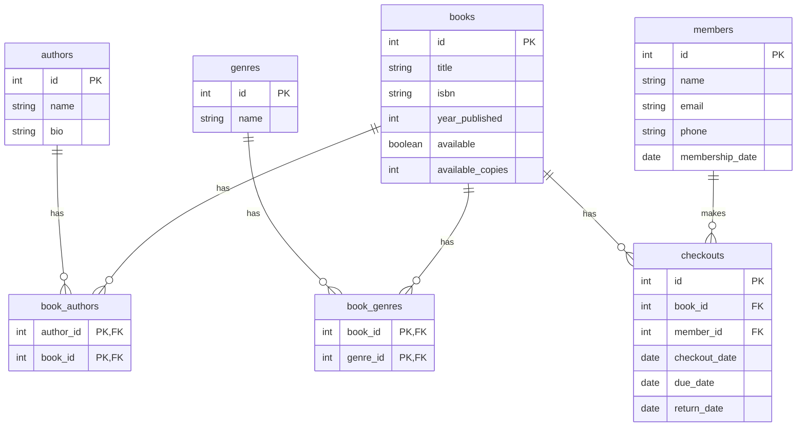

# Module 3 Project: Library Management System

## Setup

1. Activate your virtual environment:
   ```bash
   source venv/bin/activate   # Mac/Linux
   venv\Scripts\activate      # Windows
   ```
2. Install dependencies:
   ```bash
   pip install -r requirements.txt
   ```
3. Seed the database with sample data:
   ```bash
   python seed_data.py
   ```
4. Launch the CLI:
   ```bash
   python cli.py
   ```

## Entity-Relationship Diagram (ERD)



## What You're Building

A command-line library management system backed by SQLAlchemy. You'll implement:

- **Models** (`library_system.py`): Book, Author, Member, Genre with proper relationships
- **CRUD operations**: Add books/borrowers, check out and return books
- **Queries**: Search by author, find overdue books, most popular genres
- **CLI** (`cli.py`): A menu-driven interface for all operations

## Schema Details

## Schema Details

- **Author**: `id` (PK), `name`, `bio` (optional)[cite: 10]
- **Genre**: `id` (PK), `name` (unique)[cite: 10]
- **Book**: `id` (PK), `title`, `isbn` (unique), `published_year` (optional), `available` (bool), `available_copies` (int). Many-to-many relationship with `Author` (`book_author`) and `Genre` (`book_genres`).[cite: 10]
- **Member**: `id` (PK), `name`, `email` (unique), `phone` (optional), `membership_date`[cite: 10]
- **Checkout**: `id` (PK), `book_id` (FK -> `books.id`), `member_id` (FK -> `members.id`), `checkout_date`, `due_date`, `return_date` (NULL if currently active/borrowed)[cite: 10]
- **book_author** (Association Table): `author_id` (PK, FK -> `authors.id`), `book_id` (PK, FK -> `books.id`)[cite: 10]
- **book_genres** (Association Table): `book_id` (PK, FK -> `books.id`), `genre_id` (PK, FK -> `genres.id`)[cite: 10]

## File Overview

| File | Job |
|------|-----|
| `library_system.py` | Implement SQLAlchemy models and database functions |
| `cli.py` | Implement menu handler functions and user interface |
| `seed_data.py` | Populate sample data to test the system |